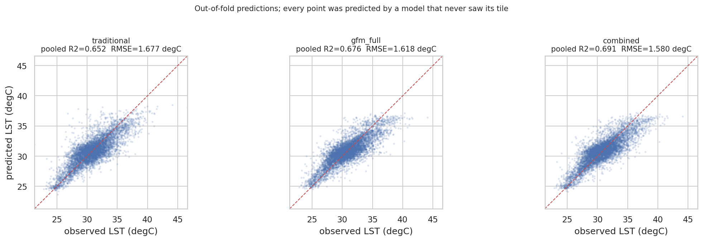
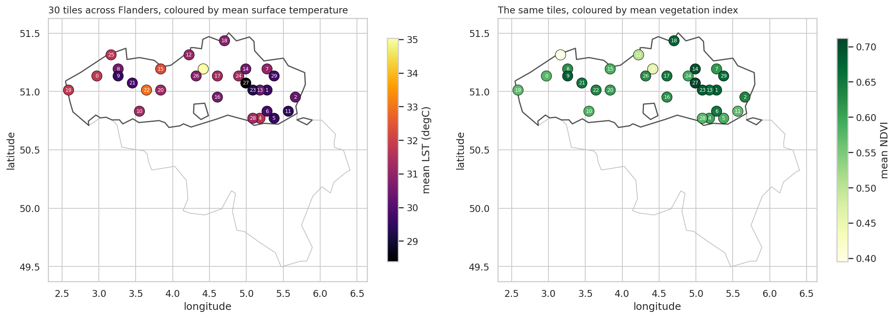
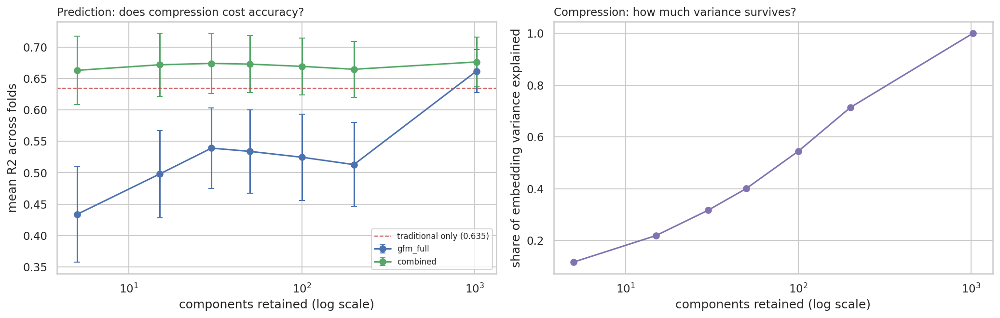
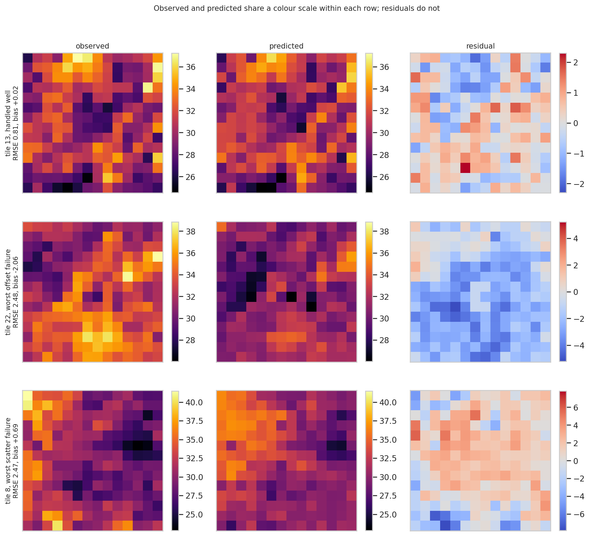
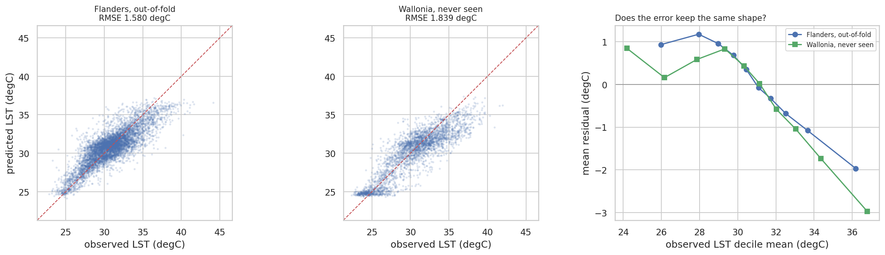

# Do foundation model embeddings help predict land surface temperature?

[](https://colab.research.google.com/github/zefanyayedija/gfm-lst-flanders/blob/main/gfm_lst_flanders.ipynb)
[](https://nbviewer.org/github/zefanyayedija/gfm-lst-flanders/blob/main/gfm_lst_flanders.ipynb)

Frozen embeddings from [Prithvi-EO-2.0-300M-TL](https://huggingface.co/ibm-nasa-geospatial/Prithvi-EO-2.0-300M-TL)
tested against NDVI, NDBI and albedo for predicting summer land surface temperature in Flanders,
with an out-of-region test in Wallonia.

The backbone is used as a fixed feature extractor and is never fine-tuned. Everything runs from
an empty directory.

| | R² | RMSE (°C) |
|---|---|---|
| NDVI, NDBI, albedo | 0.635 | 1.671 |
| Prithvi embedding alone (1024-d) | 0.662 | 1.614 |
| Both combined | 0.676 | 1.576 |
| Both combined, transferred to Wallonia | 0.747 | 1.839 |

Cross-validated with `GroupKFold` on tile, so no patch is ever scored by a model that saw its
own tile.



## Data

5,845 patches across 30 tiles in Flanders, plus 2,940 patches across 15 tiles in Wallonia. Each
tile is 224 × 224 pixels at 30 m, cut into a 14 × 14 grid of 480 m patches.

Imagery comes from a cloud-masked summer 2022 HLS S30 median composite. The target is a Landsat
8/9 Collection 2 Level 2 surface temperature composite over the same window. Features and target
are averaged over identical footprints.



## What the results say

**The embedding changes consistency more than it changes accuracy.** Mean R² rises by about
0.04, which on its own would be thin. Fold-to-fold variability falls from 0.064 to 0.039, and the
largest gain lands on the fold where the spectral indices do worst, where R² moves from 0.535 to
0.619. A general-purpose backbone with no thermal training holds performance up where
hand-designed thermal proxies become unreliable. It does not raise the ceiling. It raises the
floor.

**PCA hurts, and the way it hurts is informative.** Compressing the embedding to 30 components
costs 0.123 R² when the embedding is the only feature set, and retaining 200 components recovers
none of it. Retained variance is not the constraint, since the discarded components sit far down
the ordering. The likely cause is rotation. A Random Forest splits one coordinate at a time, and
PCA spreads whatever predicts temperature across many coordinates at once.



The combined condition stays nearly flat across the whole sweep, including at five components.
Reading only that curve would suggest the embedding compresses cheaply, which the other curve
shows it does not.

**Two distinct failure modes.** Of 30 tiles, 9 fail through a constant offset and 21 through
unresolved internal variation. The two groups separate by how much temperature varies inside the
tile, with mean within-tile spread of 1.95 °C against 2.68 °C. The embedding helps the second
group roughly twice as much as the first, which follows, since no feature computed from a tile's
own imagery can recover the level of a tile that was held out.



**Transfer costs about a sixth of the accuracy.** RMSE rises from 1.58 to 1.84 °C on a region the
model never saw, with a cold bias of roughly a third of a degree appearing where Flanders had
essentially none.

R² moves the other way, from 0.691 to 0.747, and that is an artefact. R² is scored against the
variance of whatever it is computed on, and temperature in the Wallonian sample spreads 1.29
times as widely. Reporting R² alone would have described a model that transferred better than it
trained.



## What this is not

The model predicts 480 m temperature from 480 m imagery on the same dates. It is not a
downscaling model and it fills no gap the Landsat product does not already fill, so no
wall-to-wall temperature surface is produced. A map of predicted temperature across Flanders
would describe something already directly observable.

## Limitations

Thirty tiles is the effective sample for anything spatial, whatever the patch count says.

No significance test is reported. Five folds give five paired observations whose training sets
overlap in most of their rows, so the spread across folds understates the true variability. Win
counts and worst-fold margins are reported instead.

Tile centres come as close as one tile width, so two tiles sit edge to edge. Grouping on tile
removes the largest form of leakage without making test tiles independent.

One summer, one country. The PCA result is a statement about axis-aligned splitting and may not
hold for a rotation-invariant learner.

Section 8 screens six candidate explanations for tile-level error and rejects five. The one that
survives, error falling as vegetation cover rises, was not predicted in advance and comes from a
sample where one pass by chance is roughly an even bet. It is a lead, not a finding.

## Running it

```bash
pip install -r requirements.txt
```

With `data/patches.csv` and `data/embeddings.npy` present, the notebook runs on CPU in a few
minutes and needs no Earth Engine account. Both are committed here, so a fresh clone reproduces
every number above without any external service.

To rebuild the dataset from nothing, set `GEE_PROJECT` in Section 2 to your own Earth Engine
cloud project id and run from the top. Extraction takes roughly half an hour per region on a GPU
runtime. `FORCE_RECOMPUTE = True` in Section 0 rebuilds every cached artefact.

Point the notebook anywhere with the `GFM_LST_PROJECT_DIR` environment variable. Without it,
Colab uses a Drive folder and a local run uses `./data`.

## Repository

```
├── README.md
├── requirements.txt
├── gfm_lst_flanders.ipynb
├── data/
│   ├── patches.csv                 # 5,845 Flemish patches
│   ├── embeddings.npy              # 5,845 × 1024, float32
│   ├── wallonia_patches.csv
│   ├── wallonia_embeddings.npy
│   ├── environment.json            # package versions that produced these numbers
│   ├── flanders_manifest.json      # extraction provenance
│   └── wallonia_manifest.json
└── figures/
```

Model outputs, fold assignments and cross-validation results are not committed. They regenerate
deterministically from the two data files, and `environment.json` records what was installed when
the numbers above were produced.

## Sources

| | |
|---|---|
| `NASA/HLS/HLSS30/v002` | six-band surface reflectance |
| `LANDSAT/LC08/C02/T1_L2`, `LC09` | surface temperature target |
| `FAO/GAUL/2015/level1` | region boundaries for tile sampling |
| [geoBoundaries](https://www.geoboundaries.org/) gbOpen, CC-BY 4.0 | administrative outlines in the maps |
| [Prithvi-EO-2.0-300M-TL](https://huggingface.co/ibm-nasa-geospatial/Prithvi-EO-2.0-300M-TL) | embedding backbone |

Code released under the MIT Licence. The satellite products and the backbone carry their own
terms.
